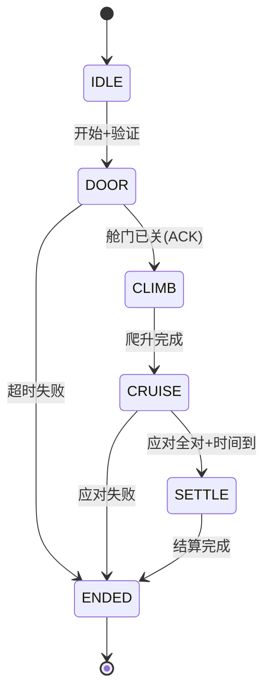

# 开发文档 · 模拟民航客舱体感安全系统

> 这份文档的目的:讲清楚「这是一个怎样的系统、为什么这样设计」。
> 写作原则:重架构判断,轻功能罗列。功能清单一笔带过,设计取舍才是重点。
> 核心是第 4 章「会话状态机」——它是整个系统的脊柱,其余章节都挂在它上面。
> 【】内是给你的填写提示,填完删掉。

---

## 1. 项目概述

### 1.1 一句话定位
【一句话说清这个系统是什么。例:让普通用户通过硬件操作,体验一次"流程化、有成败判定"的简化飞行模拟,后端负责流程编排、操作判定与数据沉淀。】

### 1.2 目标用户与核心价值
【谁用、用来干嘛、为什么是"关卡/流程"而不是"采集展示"。点出这个系统的技术重心在后端的流程编排与判定,不在硬件本身。】

### 1.3 硬件清单与角色划分
| 硬件 | 角色 | 在系统中负责 |
|---|---|---|
| W601 | 输入设备 | 【接收红外遥控器按键,翻译成语义指令上报】 |
| ESP32 | 执行 + 姿态采集 | 【摇杆姿态采集;接收下行指令驱动执行器(雨刮/舱门等)】 |
| 红外遥控器 + 接收头 | 用户操作入口 | 【用户统一的操作介质,按键→语义指令】 |
| 各传感器(光敏/雨滴/震动/倾斜) | 事件触发源 | 【外部介入模拟特殊事件】 |
| 执行器(舵机/蜂鸣器等) | 应对动作的物理出口 | 【响应后端下行指令】 |

> 设计要点:**输入设备(W601)与执行设备(ESP32)互不通信,全部经后端中转。** 见第 3 章。

---

## 2. 系统架构总览

### 2.1 架构图
【画一张框图:W601 / ESP32 / 传感器 → EMQX → Java 后端 → WebSocket/HTTP → 前端。
标清楚哪些是上行(设备→后端)、哪些是下行(后端→设备)、哪些是实时流、哪些是请求响应。】

### 2.2 两种范式的共存(本系统的关键特征)
本系统同时存在两类数据流,采用两种不同的处理范式:

- **事件驱动 / 实时流**:摇杆姿态、传感器告警、设备状态。特征是连续、被动、无"请求"。用 MQTT 订阅 + WebSocket 推送处理,**没有 Controller**。
- **请求-响应 / 事务**:用户登录、开始/结束模拟、查历史、结算积分。特征是有头有尾、由用户动作触发。用 Controller-Service 处理。

【展开说:这两条线在哪里交汇?——交汇点是"会话"。实时流的数据要归属到某个用户的某次会话中落库。这就是本系统比纯 CRUD 系统多出来的复杂度,也是设计重点。】

### 2.3 技术选型
| 层 | 选型 | 理由(一句话) |
|---|---|---|
| 消息中间件 | EMQX (MQTT) | 【设备解耦、上下行、QoS】 |
| 后端 | Spring Boot | 【】 |
| 实时推送 | WebSocket | 【】 |
| 数据库 | 【MySQL?】 | 【】 |
| 设备端 | ESP32(MicroPython)/ W601 | 【】 |

---

## 3. 设备编排模型(后端为大脑)

### 3.1 核心原则
【说清楚:W601 是"眼睛"(收按键)、ESP32 是"手"(执行动作),两者不直接通信,业务逻辑全部上收到后端。没有后端,这套设备只是一盘各转各的散沙——是后端把它们编排成一个有逻辑的系统。这是本系统后端价值的根本所在。】

### 3.2 上行链路(设备 → 后端)
【设备只上报"客观事实",不做业务判断。例:雨滴传感器只报"湿度=湿",不报"该开雨刮";W601 只报"按了键1",不报"开雨刮"。业务语义的解释权在后端。】

### 3.3 下行链路(后端 → 设备)+ 指令回执对账 ★
这是本系统的核心技术点之一,单独展开:

- 后端下发指令(如"开启雨刮")到 ESP32,**不能假设一定成功**。物理上存在:设备没收到、收到但执行器卡住、执行了但回执丢失。
- 因此每条下行指令必须带 `commandId`,设备执行后回 ACK(原样带回 `commandId` + 执行结果)。后端收到 ACK 才认为指令闭环。
- 超时未收到 ACK 的处理策略:【重发 N 次?标记设备异常?这次模拟判失败?——填你的策略】
- 【画一张时序图:下发→执行→ACK→确认;以及下发→超时→重发/异常 的分支】

> 这一点对应简历叙事:"设备指令对账、最终一致性",且这次另一端是会真卡住的物理执行器,比纯软件版本更刁钻。

---

## 4. 会话状态机 ★★(系统脊柱,最重要一章)

> 整个系统的"流程化关卡"本质上就是这台状态机。所有判定逻辑都挂在它上面:
> 同一个操作,在不同状态下含义不同(甚至该不该响应都不同)。
> **先把这一章填实,再写后面的接口文档。**

### 4.1 状态定义
| 状态 | 含义 | 该状态下允许的用户操作 | 该状态下设备状态 |
|---|---|---|---|
| 待机 IDLE | 【未开始,硬件待机/禁用】 | 【仅"开始模拟"】 | 【禁用】 |
| 舱门操作 DOOR | 【要求用户关舱门】 | 【】 | 【】 |
| 起飞爬升 CLIMB | 【摇杆控制抬升】 | 【】 | 【】 |
| 巡航应对 CRUISE | 【触发事件、要求应对】 | 【】 | 【】 |
| 进近结算 SETTLE | 【流程结束、计算结果】 | 【】 | 【】 |
| 已结束 ENDED | 【成功/失败终态】 | 【仅查看本次数据】 | 【禁用】 |
【状态名和划分按你实际流程改,这只是示例骨架】

### 4.2 状态迁移
| 当前状态 | 触发事件 | 目标状态 | 迁移条件 / 备注 |
|---|---|---|---|
| IDLE | 用户点"开始" + 验证通过 | DOOR | 【下发"启用设备"指令,等 ACK】 |
| DOOR | 收到"舱门已关"回执 | CLIMB | 【】 |
| DOOR | 超时未关 | ENDED(失败) | 【超时阈值?】 |
| CLIMB | 【达到目标姿态/时间】 | CRUISE | 【】 |
| CRUISE | 事件应对全部正确 + 时间到 | SETTLE | 【】 |
| CRUISE | 某事件应对失败 | ENDED(失败) | 【是立即失败,还是记一笔继续?】 |
| SETTLE | 结算完成 | ENDED(成功) | 【触发积分里程结算,幂等】 |
【把你的真实流程填进去。重点想清楚每个"失败迁移"的触发条件】

### 4.3 状态图
【用 Mermaid 或手绘,把上表画成状态图。这张图是答辩时最该展示的一页。】

---

## 5. 操作判定逻辑

### 5.1 判定为什么必须在后端
【说清:判定是规则,规则要可改、可复盘、要落库;设备/前端不可信,不能把"对错"交给它们。设备只报客观事实,后端结合状态机判对错。】

### 5.2 判定模型:事件—时间窗—应对
【展开核心判定逻辑。例:在 CRUISE 状态、"下雨"事件触发后的 N 秒安全窗内,是否收到了"雨刮开启"的回执——是则该事件记成功,否则失败(并区分:没做/做错/超时)。】

### 5.3 按键 × 状态 → 动作/判定 映射表 ★
> 关键:键码→指令不是静态字典,而是结合当前状态判定。

| 当前状态 | 按键 | 是否响应 | 判定结果 | 后端动作 |
|---|---|---|---|---|
| CRUISE(下雨事件激活) | 键1(雨刮) | 是 | 正确应对 | 【下发开雨刮指令 + 事件记成功】 |
| CRUISE(无事件) | 键1(雨刮) | 【忽略?记瞎操作?】 | 【】 | 【】 |
| DOOR | 键1(雨刮) | 【否,违规?】 | 【】 | 【】 |
【把"按键在每个状态下的含义"枚举清楚,这张表是判定逻辑、指令映射、状态机的共同视图】

---

## 6. 数据模型

### 6.1 ER 关系
【用户 1—N 模拟记录 1—N 事件。画 ER 图。】

### 6.2 表结构
**用户表 user**
| 字段 | 类型 | 说明 |
|---|---|---|
| id | bigint PK | |
| username | varchar | |
| password | varchar | 【加密存储,别明文】 |
| total_mileage | int | 【累计里程】 |
| total_points | int | 【累计积分】 |
| ... | | |

**模拟航班记录表 flight_record**
| 字段 | 类型 | 说明 |
|---|---|---|
| id | bigint PK | |
| user_id | bigint FK | |
| start_time / end_time | datetime | |
| result | tinyint | 【成功/失败】 |
| mileage / points | int | 【本次获得】 |
| ... | | |

**事件表 flight_event** ★(粒度要细,见提示)
| 字段 | 类型 | 说明 |
|---|---|---|
| id | bigint PK | |
| record_id | bigint FK | |
| event_type | varchar | 【哪类事件:下雨/颠簸/...】 |
| triggered_at | datetime | 【何时触发】 |
| expected_action | varchar | 【要求的正确应对】 |
| actual_action | varchar | 【用户实际操作】 |
| responded_at | datetime | 【何时应对】 |
| result | tinyint | 【成功/失败】 |
| fail_reason | varchar | 【没做/做错/超时】 |

> 提示:事件表别只用一个布尔表示成败。记细(触发时间、要求动作、实际动作、应对时间、失败原因),
> 因为第 8 章的 AI 总结吃的就是这张表——记多细决定了 AI 点评的天花板。

---

## 7. 结算机制(积分 / 里程)

### 7.1 计算规则
【里程怎么算、积分怎么算、成败如何影响。填规则。】

### 7.2 结算幂等 ★
【"结束模拟→结算"必须幂等:重复点结束、网络重试,不能让积分翻倍。说明你的幂等方案(状态判重?唯一约束?)——直接复用你 Hakimi 那套思路。】

---

## 8. AI 飞行总结(收尾功能,非重点)

【把本次飞行数据(尤其细粒度事件表)喂给大模型,生成一段个性化点评。
说明:输入是什么、prompt 大致结构、输出展示在哪。
定位:观感加分项,工程深度低,放最后做,别花主要精力。】

---

## 9. 范围与边界(诚实声明)

【明确哪些是真实物理闭环、哪些是流程模拟。例:舵机关舱门、摇杆控姿态、雨滴→雨刮 这几组是真物理动作;
其余阶段用软触发推进流程。硬件就几个件,不硬凑满每一步——讲清边界比假装full更显得拎得清。】
